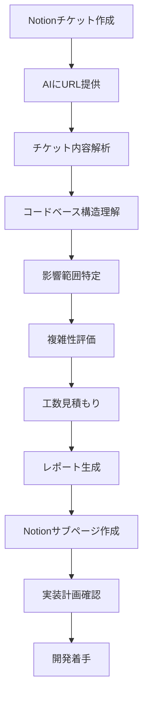

# チケット影響分析・工数見積もりツール

[](https://opensource.org/licenses/MIT)
[](#)

## 📋 概要

このリポジトリは、Notionチケットを分析して技術的な影響範囲を特定し、実装工数を自動見積もりするAI プロンプトテンプレート集です。フロントエンド・バックエンドのコードベース分析を通じて、2〜16時間の範囲で精密な工数見積もりを行います。

## 🎯 主要機能

- **自動チケット分析**: Notion APIを通じてチケット内容を取得・解析
- **包括的影響分析**: フロントエンド・バックエンド・データベースへの影響範囲を特定
- **精密工数見積もり**: 複雑性指標に基づく2,4,8,12,16時間の段階的見積もり
- **自動レポート生成**: Notionサブページ形式での詳細分析レポート作成
- **実装計画提案**: フェーズ別の具体的実装手順を提示

## 🏗️ システム構成

```
ticket-impact-analysis-with-estimation/
├── prompts/
│   ├── ticket-impact-analysis-with-estimation.md  # メインプロンプトテンプレート
│   ├── estimation-criteria.md                     # 工数見積もり基準定義
│   ├── analysis-commands.md                       # コードベース分析コマンド集
│   └── templates/
│       └── notion-page-template.md                # レポート出力テンプレート
├── docs/
│   └── schemas/
│       └── internal-json-schema.json              # 内部データ構造定義
└── README.md                                       # 本ドキュメント
```

## 📄 各ファイルの役割

### 1. `prompts/ticket-impact-analysis-with-estimation.md` - メインプロンプトテンプレート

**目的**: AIアシスタント向けの包括的な分析・見積もり指示書

**主要機能**:
- チケット情報の自動取得・解析プロセス定義
- 6段階の分析フェーズ（チケット分析→構造理解→影響特定→複雑性評価→工数算出→結果出力）
- エラーハンドリング戦略の明確化
- Notionサブページ自動作成の実装手順

**使用タイミング**: AIアシスタントの初期設定時に読み込み

### 2. `prompts/estimation-criteria.md` - 工数見積もり基準定義

**目的**: 客観的で一貫性のある工数見積もりのための判定基準

**定義内容**:
- **時間範囲別特徴**:
  - 2時間: シンプルなUI修正、軽微なAPI変更
  - 4時間: 小規模機能追加、単一コンポーネント実装
  - 8時間: 中規模機能追加、API+UI統合実装
  - 12時間: 大規模機能追加、データ構造変更
  - 16時間: アーキテクチャ変更、新技術導入

- **複雑性倍率体系**:
  - フロントエンド: 1.0〜1.5倍（既存パターン〜複雑な状態管理）
  - バックエンド: 1.0〜1.5倍（標準CRUD〜外部システム統合）
  - データ層: 1.2〜2.0倍（カラム追加〜複雑マイグレーション）
  - 外部統合: 1.3〜2.0倍（API拡張〜複雑データ変換）
  - 新技術: 1.5〜2.0倍（チーム経験有〜完全新規）

### 3. `prompts/analysis-commands.md` - コードベース分析コマンド集

**目的**: 体系的なコードベース分析のためのコマンドリファレンス

**分析カテゴリ**:

#### フロントエンド分析
- **コンポーネント影響分析**: React/Vue/Angularコンポーネントの依存関係調査
- **ページ/ルーティング分析**: ページレベルの影響範囲特定
- **APIルート分析**: Next.js/Nuxt.js等のAPIルート影響調査
- **状態管理分析**: Redux/Vuex/Context等の状態管理影響評価

#### バックエンド分析
- **ハンドラー分析**: APIエンドポイントハンドラーの影響調査
- **サービス層分析**: ビジネスロジック層の影響範囲特定
- **データ層分析**: リポジトリ/モデル層の変更影響評価
- **スキーマ分析**: データベーススキーマ・マイグレーション影響調査

#### 共通分析
- **型定義分析**: TypeScript/型システムの影響範囲特定
- **設定ファイル分析**: 環境変数・設定変更の影響評価
- **プロジェクト構造分析**: 全体アーキテクチャの理解

### 4. `prompts/templates/notion-page-template.md` - レポート出力テンプレート

**目的**: 一貫性のある分析結果レポートの自動生成

**レポート構成**:
- **📋 分析概要**: チケット概要・見積工数・複雑度・実行日時
- **🎯 要件分析**: 機能要件・技術要件の整理
- **🔍 根本原因分析**: バグ修正時の原因特定（条件付き表示）
- **📁 影響範囲詳細**: フロントエンド・バックエンド・DB・設定への具体的影響
- **🚀 推奨実装手順**: 4フェーズ（設計・BE実装・FE実装・テスト統合）の詳細計画
- **✅ 完了チェックリスト**: 開発・テスト・デプロイ準備のタスクリスト
- **⚠️ リスク・考慮事項**: 技術的リスク・前提条件・潜在的阻害要因
- **📊 工数見積もり根拠**: 見積内訳・信頼度レベルの透明性確保

### 5. `docs/schemas/internal-json-schema.json` - 内部データ構造定義

**目的**: 分析処理中のデータ構造標準化のためのJSONスキーマ定義

**提供内容**:
- チケット情報の標準化された構造定義
- 影響分析結果（フロントエンド・バックエンド・データベース）の構造
- 工数見積もり結果と複雑性倍率の定義
- 実装フェーズ計画とリスク評価の構造
- 分析メタデータ（実行日時、バージョン等）の定義

**主要構造**:
- `ticket_info`: チケット基本情報（タイトル、URL、要件）
- `impact_analysis`: フロントエンド・バックエンド・データベースの影響分析
- `estimation`: 基本時間・複雑性倍率・最終見積もり・信頼度
- `implementation_phases`: フェーズ別実装計画
- `risks`: リスクカテゴリと対応策
- `metadata`: 分析実行情報

## 🚀 使用方法

### 基本的な使用手順

1. **プロンプト読み込み**:
   - `prompts/ticket-impact-analysis-with-estimation.md` をAIアシスタントに読み込ませる
   - 関連ファイル（見積もり基準、分析コマンド、テンプレート）も合わせて参照

2. **チケット分析実行**: NotionチケットURLを引数として指定
   ```
   <NotionチケットURL> を分析してください
   ```

3. **自動分析実行**: AIが以下を順次実行
   - Notion APIでチケット内容取得・解析
   - `prompts/analysis-commands.md` のコマンドでコードベース影響分析
   - `prompts/estimation-criteria.md` の基準に基づく工数見積もり
   - `prompts/templates/notion-page-template.md` に従ったレポート生成

4. **結果確認**:
   - 生成されたNotionサブページで詳細分析結果を確認
   - 実装計画・リスク評価・チェックリストを活用して開発計画立案

### 高度な使用方法

- **カスタマイズ**: プロジェクト固有のパス・技術スタックに合わせて分析コマンドを調整
- **基準調整**: チーム経験・プロジェクト特性に応じて見積もり倍率を微調整
- **テンプレート拡張**: 組織特有の要件に合わせてレポートテンプレートを拡張

## 🎯 対象プロジェクト

- **フルスタックWebアプリケーション**: Next.js, Nuxt.js, React+Express, Vue+Nest.js等
- **モダンフロントエンド**: React, Vue, Angular + TypeScript
- **バックエンドAPI**: Node.js, Go, Python, Ruby等
- **データベース**: PostgreSQL, MySQL, MongoDB等

## 🔧 必要な前提条件

### 技術環境
- Notion API アクセス権限
- コードベース分析ツール（MCP Serena、Claude Code等）
- AIアシスタント（Claude、ChatGPT等でプロンプトを実行）

### プロジェクト要件
- Gitベースのバージョン管理
- 構造化されたディレクトリ構成
- TypeScriptまたは型定義システム（推奨）

## 📊 見積もり精度

### 精度レベル
- **高精度（±20%）**: 既存パターンに従う標準的な機能追加
- **中精度（±30%）**: 新しいパターンを含む中規模機能
- **低精度（±40%）**: 大規模アーキテクチャ変更・新技術導入

### 精度向上要因
- コードベースの構造化度合い
- 既存パターンとの類似性
- チームの技術習熟度
- 要件の明確性

## 🔄 ワークフロー例



## 🤝 コントリビューション

### 改善提案
- 新しい技術スタックへの対応
- 見積もり精度の向上
- 分析コマンドの拡充
- テンプレートの機能強化

### 開発方針
- **再現性**: 同じチケットに対する一貫した分析結果
- **透明性**: 見積もり根拠の明確な提示
- **拡張性**: 多様なプロジェクト・技術スタックへの適応
- **実用性**: 実際の開発現場での実用的な精度

## 📝 ライセンス

MIT License

## 🔗 関連リソース

- [Notion API Documentation](https://developers.notion.com/)
- [Claude Code Documentation](https://docs.claude.com/en/docs/claude-code)
- [MCP (Model Context Protocol)](https://github.com/anthropics/model-context-protocol)

---

**作成者**: h_iwakubo
**バージョン**: 1.0.0
**最終更新**: 2025年1月22日
**リポジトリ**: [ticket-impact-estimation](https://github.com/emrum01/ticket-impact-estimation)